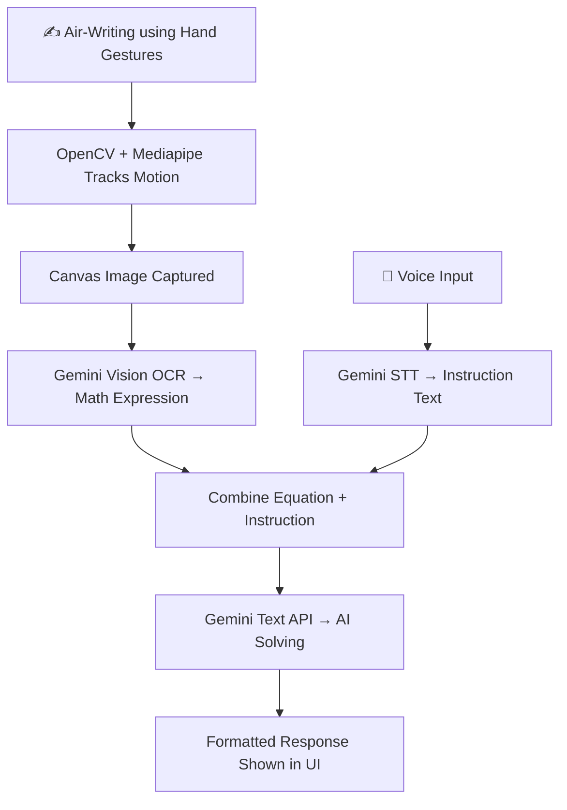

# ✍️ Equation Eye – AI-Powered Virtual Math Solving from Air-Writing

An intelligent, interactive math assistant that lets users **draw equations in the air**, **speak instructions**, and **solve them using Gemini AI**. Built with OpenCV, Mediapipe, Flask, and Gemini Vision & LLM APIs.

---

## 📂 Features

- ✅ Real-time hand gesture tracking with Mediapipe
- ✅ Drawing captured from webcam using OpenCV
- ✅ Math OCR using Gemini Vision (image input)
- ✅ Voice command transcription via Gemini STT
- ✅ Query combination and intelligent solving using Gemini Pro
- ✅ Interactive UI with TailwindCSS + Dark/Light toggle
- ✅ Fully modular Flask backend with clean separation

---

## 🛠️ Tech Stack

| Component         | Technology                  |
|------------------|-----------------------------|
| UI/Frontend       | HTML, TailwindCSS, JavaScript |
| Backend API       | Python + Flask              |
| Hand Tracking     | Mediapipe + OpenCV          |
| OCR (Image to Text)| Gemini Vision API          |
| Voice to Text     | Gemini Speech-to-Text       |
| LLM Solver        | Gemini Pro (via Google GenAI SDK) |
| App Architecture  | Flask + Modular File System |

---
## 🧠 Architecture Flow

---
## 🧠 Quick Architecture Flow

---

## 🚀 Demo Features

📌 Air-write any math expression using hand gestures  
📌 Extract the equation using Gemini Vision (image-to-text)  
📌 Speak instructions (e.g., "solve step-by-step")  
📌 Combines both and sends to Gemini for instant solving  
📌 Toggle between dark/light themes  
📌 Real-time UI built with TailwindCSS  

---

## 📦Installation & Running Locally

    git clone "https://github.com/likithkumar003/Equation_Eye.git"
    cd Equation_eye

## (Optional) Create a virtual environment
    python -m venv venv
    source venv/bin/activate  # On Windows: venv\Scripts\activate

## Install dependencies
    pip install -r requirements.txt

## 🚀Start the Flask app
    python app.py

